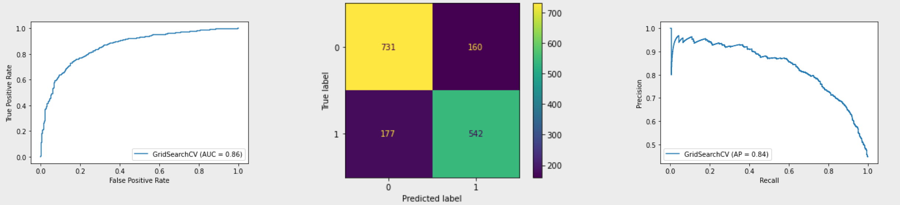
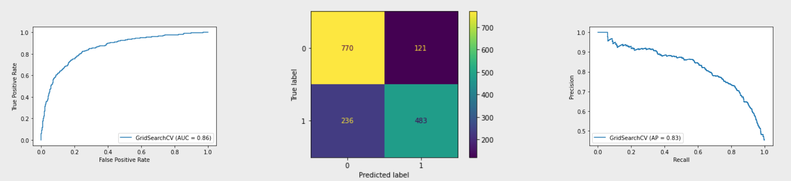
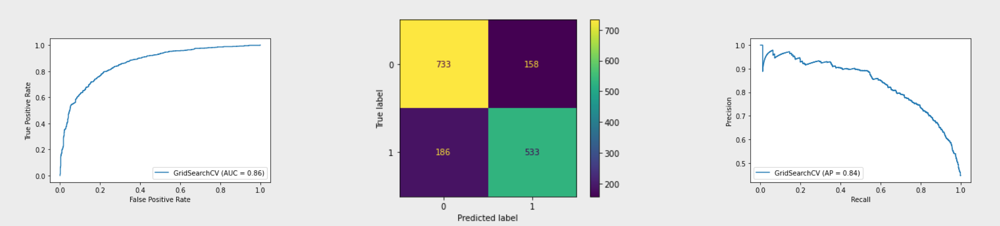
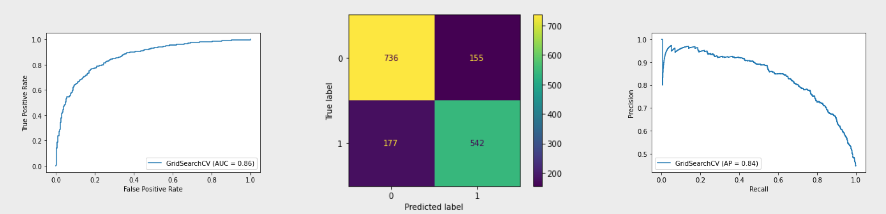

 <h1> Who Wants Shots? </h1> 

 <h4> Seasonal Flu Edition </h4> 

  

 Photo by <a href="https://unsplash.com/@myriamzilles?utm_source=unsplash&utm_medium=referral&utm_content=creditCopyText">Myriam Zilles</a> on <a href="https://unsplash.com/collections/IUPhDJeZav4/flu-vaccination-social?utm_source=unsplash&utm_medium=referral&utm_content=creditCopyText">Unsplash</a> 

 <h4> Phase 3 Project by Ashley Eakland </h4> 

 &#129347; Not that kind... &#x1F943;

 &#128137; THIS kind! &#x1F489;

Utilizing data courtesy of the United States National Center for Health Statistics, I hope to be able to predict whether or not a given citizen will choose to be vaccinated based on existing patterns from survey results from the 2009 National Health Flu Survey. 

Stakeholder: Small research firm on behalf of the Office of Infectious Diseases (subdivision of the US Department of Health and Human Services).

Business Problem: Guiding public health efforts with regard to vaccination status based on underlying patterns in the opinions, backgrounds, educations and other socio-economic factors in the general population with the goal to increase the number of vaccinated citizens. 

##### Target Variable - Seasonal Flu Vaccine  

##### Target Metric(s) - Accuracy Percentage, AUC, Precision -  Precision is targeted as in this scenario, a False Positive would be worse than a False Negative. False positive cases would be unvaccinated populations left out of consideration of public outreach programs versus a vaccinated person being offered something they'd already received.
    * False Positive -> Precision Score -> Predicts Vaccinated, Citizen was Un-vaccinated. 
    * False Negative -> Recall Score -> Predicts Un-vaccinated, Citizen was vaccinated. 

##### Null Hypothesis: Predicting if a citizen will get vaccinated based on behaviors and underlying patterns from survey data will be no more accurate than a 50/50 guess. (H0 accuracy = 50%)

##### Alt Hypothesis: Predicting if a citizen will get vaccinated based on behaviors and underlying patterns from survey data will exceed accuracy of random guessing. (HA accuracy > 50%)

# Data Understanding

Here we have a dataset provided by the US National Center for Health Statistics. The merged dataframe consists of 26,707 survey responses to 37 questions. All of the data is categorical in nature, with the majority of the questions being yes or no answers, though there are some ranking scales (1 to 5, 1 to 3) and encoded values for anonymity of survey respondents. Some questions were not answered by all respondents. 

Columns represent the questions asked in the survey, while rows represent the survey respondents. 

Survey questions/column headers are as follows:
 * respondent_id - Number assigned to survey respondent
 * h1n1_concern - Level of concern about the H1N1 flu. (Omitted from this Seasonal Flu Analysis. Please see H1N1 Branch for this analysis.) 
     * Ranked from 0 (not at all concerned) to 3 (very concerned).
 * h1n1_knowledge - Level of knowledge about H1N1 flu. (Omitted from this Seasonal Flu Analysis.) 
     * Ranked from 0 (no knowledge) to 2 (a lot of knowledge).
 * behavioral_antiviral_meds - Has respondent taken antiviral medication? Yes/No (binary)
 * behavioral_avoidance - Has respondent avoided close contact with others with flu-like symptoms? Yes/No (binary)
 * behavioral_face_mask - Has respondent bought a face mask? Yes/No (binary)
 * behavioral_wash_hands - Has respondent frequently washed hands or used hand sanitizer? Yes/No (binary)
 * behavioral_large_gatherings - Has respondent reduced time at large gatherings? Yes/No (binary)
 * behavioral_outside_home - Has respondent reduced contact with people outside of own household? Yes/No (binary)
 * behavioral_touch_face - Has respondent avoided touching face(including eyes, nose, mouth, etc)? Yes/No (binary)
 * doctor_recc_h1n1 - Was H1N1 flu vaccine recommended by doctor? Yes/No (binary) (Omitted from this Flu predictive analysis)
 * doctor_recc_seasonal - Was Seasonal flu vaccine recommended by doctor? Yes/No (binary)
 * chronic_med_condition - Does respondent have chronic medical condition? Yes/No (binary) Conditions include: asthma or other lung condition, diabetes, heart condition, kidney condition, sickle cell anemia or other anemia, a neurological or neuromuscular condition, liver condition, or a weakened immune system caused by a chronic illness or by medicines taken for a chronic illness. 
 * child_under_6_months - Does respondent have regular close contact with a child under the age of six months? Yes/No (binary)
 * health_worker - Is respondent a healthcare worker? Yes/No (binary)
 * health_insurance - Does respondent have health insurance? Yes/No (binary)
 * opinion_h1n1_vacc_effective - Respondent's personal opinion about H1N1 vaccine effectiveness 
     * Ranked from 1 (not at all effective) to 5 (very effective).
 * opinion_h1n1_risk - Respondent's personal opinion about risk of getting sick with H1N1 flu without vaccine (Omitted from this Seasonal Flu Analysis.) 
     * Ranked from 1 (very low) to 5 (very high)
 * opinion_h1n1_sick_from_vacc - Respondent's worry of getting sick from taking H1N1 vaccine (Omitted from this Seasonal Flu Analysis.)
     * Ranked from 1 (not at all worried) to 5 (very worried)
 * opinion_seas_vacc_effective - Respondent's personal opinion about seasonal flu vaccine effectiveness 
     * Ranked from 1 (not at all effective) to 5 (very effective)
 * opinion_seas_risk - Respondent's personal opinion about risk of getting sick with seasonal flu without vaccine 
     * Ranked from 1 (very low) to 5 (very high)
 * opinion_seas_sick_from_vacc - Respondent's worry of getting sick from taking seasonal flu vaccine 
     * Ranked from 1 (not at all worried) to 5 (very worried).
 * age_group - Age group of respondent - Ranges are 18-34, 35-44, 45-54, 55-64, and 65+ Years.
 * education - Self-reported education level. Less than 12 years, 12 years, Some College, or College Graduate.
 * race - Race of respondent. White, Black, Hispanic, and Other/Multiple.
 * sex - Sex of respondent. Male or Female 
 * income_poverty - Respondent annual household income with respect to 2008 Census poverty thresholds.
     * "Below Poverty", "<= \\$75,000 Above Poverty" , or "> \\$75,000"
 * marital_status - Marital status of respondent.
     * Married or Not Married
 * rent_or_own - Housing situation of respondent.
     * Rent or Own
 * employment_status - Employment status of respondent.
     * Employed, Not in Labor Force, or Unemployed
 * hhs_geo_region - Respondent's residence using a 10-region geographic classification defined by the U.S. Dept. of Health and Human Services. Values are represented as short random character strings.
 * census_msa - Respondent's residence within metropolitan statistical areas (MSA) as defined by the U.S. Census.
 * household_adults - Number of OTHER adults in household, responses range 0 through 3.
 * household_children - Number of children in household, responses range 0 to 3.
 * employment_industry - Industry respondent is employed in. Values are represented as random, encoded character strings.
 * employment_occupation - Occupation of respondent. Values are represented as random, encoded character strings.
 * h1n1_vaccine - Target Variable for H1N1 predictive analysis (Omitted from this Seasonal Flu Analysis.)
 * seasonal_vaccine - Target Variable for seasonal flu predictive analysis

# Data Analysis and Preparation

For the project submission, I am submitting my Seasonal Flu analysis, though I did complete analysis on both the H1N1 and Sesonal Flu targets. I will discuss the data preparation and modeling steps for each below. The notebook for the H1N1 analysis can be found on the H1N1 branch of the repository.

### Seasonal Flu 

Through EDA, I discovered there are several object columns that will need to be One Hot Encoded in order to be modeled, including age_group, education, race, sec, marital_status, and employment_industry and occupation, among others. These could turn out to be important features, so I will encode so as to maintain as many features as possible for modeling.

Many columns have many missing values. Survey respondents clearly did not answer every question, which I would expect. After evaluation and modeling with the H1N1 set in my H1N1 notebook, I opted to drop the null values from this seasonal flu dataframe. The balance of classes is much closer in the seasonal vaccine target, which intuitively makes sense. The seasonal flu is, as it's nomenclature would suggest, "seasonal" and annually reoccuring, whereas the H1N1 was a 'pandemic' and rare event. Even after dropping the null values, total counts still exceed 6400 complete survey responses, which I deem to be an adequate count for modeling at this stage. 

# Modeling

## Seasonal Flu

### Logistic Regression

The first model I wanted to try was logistic regression. I started with a base model and no tuning, with a cross validation of 5 folds. Mean cross-validation score was 79% and violin plot shows a bit of variance in the score distribution. Opted to run a GridSearchCV to fine tune the hyperparameters. GridSearch deemed optimal parameters to be {'max_iter': 100, 'penalty': 'l2', 'solver': 'newton-cg'} and upon applying these hyperparameters, saw little improvement in the score percentage. Variation decreased drastically on the violin plot visualization. 

Scores of the GridSearch tuned LogisticRegression model (`lr_gscv`):

Accuracy: 0.7906832298136646

Precision: 0.7720797720797721

Recall: 0.7538247566063978

F1 Score: 0.7628430682617875

AUC: 0.86

### Decision Trees

Decision Trees were the next model for attempt. Base untuned model, as expected, fit the training data perfectly, but upon cross-validation with 5 folds returned a mean score of 70%. Similar to the Logistic Regression, I ran a GridSearch to find optimal tuning parameters. With the grid search returning a mean cross-val score still at 76%, I opted to move on to RandomForests to increase variability in my trees and hopefully return better scores.

### Random Forests

The first RandomForest with no tuning returns a mean cross validated score of 78% - an improvement over the tuned DecisionTree CV score. With the RandomForests, I spent a bit more time with GridSearching to tune the parameters and find what would return the highest score. The best performing model uses the parameters {'criterion': 'gini', 'max_depth': 5, 'min_samples_leaf': 5}.

RandomForest top performing model `(rf_gs)` scores:

Accuracy: 0.7782608695652173

Precision: 0.7996688741721855

Recall: 0.6717663421418637

F1 Score: 0.7301587301587301

AUC: 0.86

Top 10 Ranking Feature Importances for model `rf_gs`:
 * opinion_seas_risk	0.143473
 * opinion_seas_vacc_effective	0.089070
 * doctor_recc_seasonal	0.062206
 * opinion_seas_sick_from_vacc	0.025423
 * household_children	0.022522
 * household_adults	0.021034
 * health_worker	0.017984
 * health_insurance	0.014769
 * behavioral_touch_face	0.013559
 * employment_industry_fcxhlnwr	0.013258
 

 
### AdaBoost and GradientBoost

Last of the models I attempted are the more advanced models. I ran both as base models and compared them against each other, then ran GridSearches on both for tuning parameters. Top performing models and tuned parameters for each model type are below.

#### AdaBoost:

Base Model
 * Mean cross-validated score 80%
 
Best Performing Model `gs_ada`
 * Params {'learning_rate': 0.5, 'n_estimators': 50}
 * Accuracy: 0.7863354037267081
 * Precision: 0.7713458755426917
 * Recall: 0.741307371349096
 * F1 Score: 0.7560283687943263
 * AUC : 0.86

 
#### GradientBoost 

I did spend a lot of time reading through the SKLearn documentation and trying some code. The source is in the code blocks and commented out below - towards the bottom of the notebook. One was utilizing the make_scorer wrapper to enable running multiple scorers within the GridSearch at one time, and then visualizing that output in terms of which hyperparameter to tune to achieve which optimal score designated. In the interest of time, I only sampled one hyperparameter, but it would be worth exploring visualizing multiple hyperparameters against multiple scorers. The second was to look at the deviance in the test set based on adjusting learning rate or the subset sample over boosting iterations. Neither subsequent test adjustment yielded significant model improvement, though it was informative reading and worthy exercises for the future. Could potentially expand further. 

Base Model
 * Mean cross-validated score 79%
 
Best Performing Model `gbc2`
 * Params {'learning_rate': 0.5, 'max_depth': 1, 'n_estimators': 200}
 * Accuracy: 0.7937888198757764
 * Precision: 0.7776183644189383
 * Recall: 0.7538247566063978
 * F1 Score: 0.7655367231638418
 * AUC : 0.86

Top Ten Ranking Feature Importances for model `gbc2`:
 * opinion_seas_risk	0.443620
 * opinion_seas_vacc_effective	0.147650
 * doctor_recc_seasonal	0.110961
 * health_insurance	0.038329
 * health_worker	0.031397
 * employment_industry_haxffmxo	0.023899
 * age_group_18 - 34 Years	0.019164
 * opinion_seas_sick_from_vacc	0.017302
 * employment_occupation_dcjcmpih	0.012162
 * rent_or_own_Own	0.011905

 
 ## Further Analysis and Limitations
 
##### Not to be used for predicting or applying to COVID-19 data.

Limitation of this analysis for both H1N1 and Seasonal Flu would be unknown employment categories to the model (i.e. the encoded string values that are OHE). Further analysis could be focused around improving the model to allow for those unknown values to pass through for analysis. Additionally, refining the structure of the features for cleaner binary classification would be a worthy step in the data cleaning process. For example, instead of OHE the marital_status - just correct that to be Married and 1/0 in the dataframe and eliminate the need for additional columns. 

A limitation of this analysis specifically for the Seasonal Flu target would be the smaller sample for this particular analysis due to time constraints. Future analysis would be centered around better restructuring of nulls and inclusion of all possible survey responses, possibly filling and binning with "prefer not to answer". Additional further analysis would work to improve performance metrics across the board, though they are consistent in the 70's on this set and less varied than the H1N1 dataset. 
